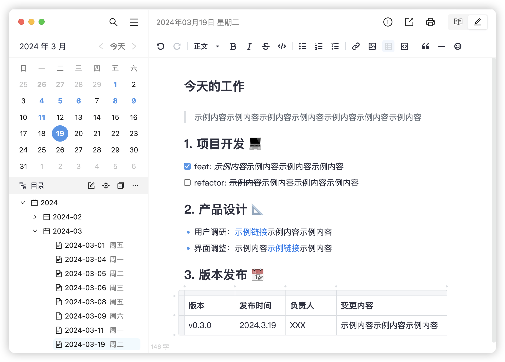

# 维克日记

维克日记是一款设计优雅的日记软件，支持Markdown语法输入和实时预览。

## 软件特性

- 一目了然的用户界面，简单免配置、开箱即用
- 支持Markdown语法输入，内容原地实时预览
- 日记支持表格可视化编辑、本地图片插入/粘贴
- 支持输入密码登录，日记隐私内容更有保障
- 支持按目录批量操作日记（如：删除等）
- 数据纯本地保存，无惧云端第三方安全风险
- 支持Windows、Mac、Linux多个系统平台

## 下载地址

> 包含历史各个版本以及系统架构(ARM等)

- [Gitee](https://gitee.com/vo-soft/vic-diary-release/releases)
- [Github](https://github.com/vo-soft/vic-diary-releases/releases)
- [百度网盘](https://pan.baidu.com/s/1buGnzFHBog-AFJhVIQicvQ?pwd=xi3u) 提取码: xi3u
- [城通网盘](https://url43.ctfile.com/d/3173743-60448486-923c16?p=3701) 访问密码：3701
